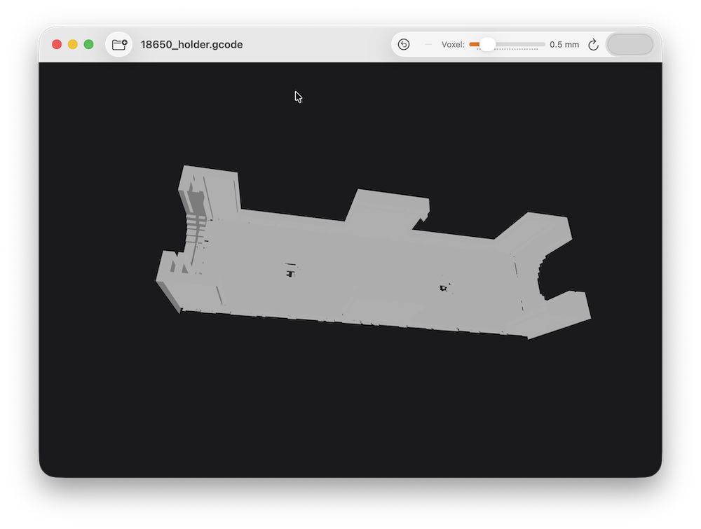

# GCode Viewer

A native macOS application that parses `.gcode` files and renders an interactive 3D surface mesh of the printed object — showing only the **outer shell**, with no internal infill, supports, or travel moves visible.



## Features

- **Surface-only rendering** — voxel shell extraction hides all internal structure; only the outer surface is displayed
- **Quick Look preview** — thumbnail and preview of `.gcode` files directly in Finder, without opening the app
- **Interactive 3D viewport** — orbit, pan, zoom, and dolly with mouse or trackpad
- **Industry-standard camera controls** — familiar shortcuts for 3D artists and engineers
- **Adjustable voxel resolution** — trade detail for speed with a live slider (0.2–1.5 mm)
- **Colour picker** — change the object colour without re-processing the file
- **Drag & drop** — drop a `.gcode` file directly onto the window
- **Open With / Finder integration** — registered as a viewer for `.gcode` files system-wide
- **Async processing pipeline** — UI stays responsive while large files load
- **Persistent settings** — voxel size, object colour, and window position/size are remembered across launches
- **No dependencies** — pure Apple frameworks only (SwiftUI, SceneKit, Metal, simd)

## Requirements

| | |
|---|---|
| macOS | 13 Ventura or later |
| Xcode | 15 or later |
| Swift | 5.10 or later |

## Building

```bash
git clone https://github.com/your-username/gcodeViewer.git
cd gcodeViewer
open gcodeViewer.xcodeproj
```

Select the **gcodeViewer** scheme, choose **My Mac** as the destination, and press **⌘R**.

No package manager or third-party dependencies are required.

## Usage

1. Launch the app.
2. Open a file via **File › Open…** (⌘O), the toolbar button, or drag a `.gcode` file onto the window.
3. Wait for parsing and mesh building to complete (progress is shown as an overlay).
4. Interact with the 3D model using the controls below.

### Camera Controls

| Input | Action |
|---|---|
| Left drag | Orbit |
| Shift + drag | Pan |
| Option + drag | Orbit (Maya convention) |
| Ctrl + drag | Dolly zoom |
| Scroll wheel | Zoom |
| Shift + scroll | Pan vertically |
| Ctrl + scroll | Pan horizontally |
| `F` | Frame / reset camera |
| `1` | Front view |
| `3` | Right view |
| `7` | Top view |
| `+` / `-` | Zoom in / out |

### Toolbar

| Control | Description |
|---|---|
| **Open…** | Open a `.gcode` file |
| **Reset Camera** | Return to default view |
| **Voxel** slider | Adjust mesh resolution (smaller = more detail, slower) |
| **Reload** | Re-process the current file with updated settings |
| **Colour** picker | Change the object colour |

## How It Works

```
.gcode file
    │
    ▼  GCodeParser — streams line by line, handles G0/G1/G28/G90/G91/G92/M82/M83
    │
    ▼  SurfaceExtractor — 3D DDA voxelisation; keeps only shell voxels
    │                     (voxels with at least one empty face-neighbour)
    │
    ▼  MeshBuilder — converts shell voxels to SCNGeometry with correct normals
    │
    ▼  SceneKitView — renders the scene, handles all camera interaction
```

The voxel approach requires no knowledge of slicer-specific print strategies. Any voxel fully enclosed by other filled voxels is automatically hidden; only the outer surface is rendered. This correctly captures vertical walls, curved surfaces, overhangs, and top/bottom faces regardless of geometry complexity.

Header moves (before the last `G92 E0` reset) are suppressed to avoid spurious geometry from the slicer preamble.

## Quick Look Extension

The app ships a Quick Look extension (`gcodeViewerQL`) that renders a 3D snapshot of any `.gcode` file directly in Finder — no need to open the app.

The extension runs in a sandboxed XPC process and uses an offscreen Metal/SceneKit renderer to produce a static PNG preview at 2× resolution. Voxel size is fixed at 1 mm for fast generation.

### UTType note

`.gcode` is not an Apple-defined type. Some applications (e.g. Pleasant3D) register `com.pleasantsoftware.uti.gcode` for this extension. This app declares both its own `de.adcore.gcode` type and imports `com.pleasantsoftware.uti.gcode`, so Quick Look previews and Finder integration work regardless of which app registered the type first.

## Project Structure

```
gcodeViewer/
├── gcodeViewerApp.swift          # @main entry point, AppDelegate, window frame persistence
├── ContentView.swift             # Root SwiftUI view, toolbar, drag & drop
├── Model/
│   ├── AppState.swift            # ObservableObject driving the load pipeline
│   ├── Move.swift                # Parsed G-code move (from, to, isExtrusion, layer)
│   └── Color+Hex.swift           # Color ↔ "#RRGGBB" hex string helpers
├── Parser/
│   └── GCodeParser.swift         # Streaming G-code parser → [Move]
├── Geometry/
│   ├── SurfaceExtractor.swift    # Voxel fill + surface shell extraction
│   ├── MeshBuilder.swift         # SCNGeometry builder
│   └── GridBuilder.swift         # Reference grid at Z = 0
└── Views/
    └── SceneKitView.swift        # GCodeSCNView subclass + SwiftUI wrapper

gcodeViewerQL/
├── PreviewProvider.swift         # QLPreviewingController — parse → voxelise → render → PNG
├── GCodeSnapshotRenderer.swift   # Offscreen Metal/SceneKit → NSImage
└── Info.plist                    # Extension manifest
```

## Performance

| File size | Parse | Mesh build | Voxels at 0.5 mm |
|---|---|---|---|
| Small (< 5 MB) | < 0.5 s | < 0.5 s | ~100 k |
| Medium (20 MB) | < 2 s | < 2 s | ~500 k |
| Large (80 MB) | < 8 s | < 8 s | ~2 M |

Increase the voxel size if performance is insufficient for a given file.

## Possible Future Enhancements

- Layer-by-layer animation with a time slider
- Colour mapping by layer height or print speed
- Cross-section clipping plane
- Mesh export (STL / OBJ)
- Multi-extruder / multi-colour support
- Metal-based renderer for very large files

## License

This project is licensed under the GNU General Public License v3.0 — see [LICENSE](LICENSE) for details.
